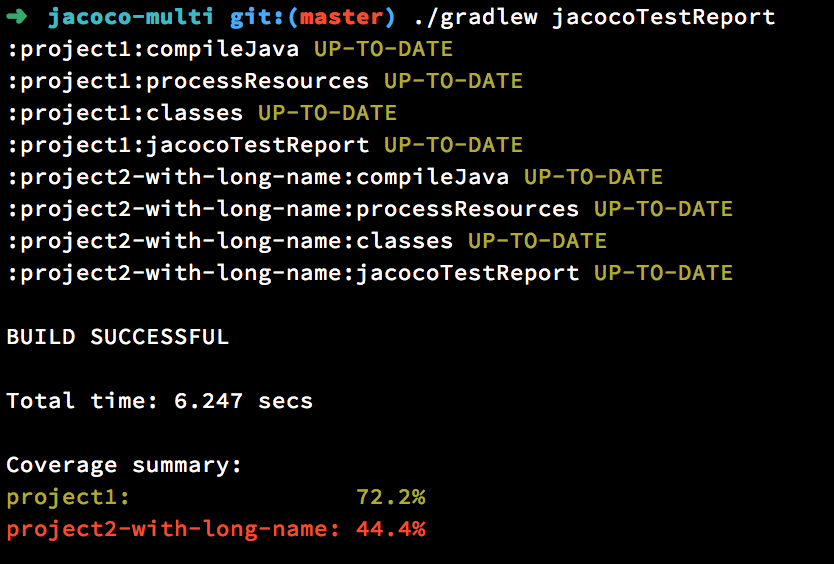

# gradle-console-reporter

[](https://travis-ci.org/ksoichiro/gradle-console-reporter)
[](https://ci.appveyor.com/project/ksoichiro/gradle-console-reporter)
[](https://coveralls.io/github/ksoichiro/gradle-console-reporter?branch=master)

> Gradle plugin to report various kinds of summaries to console.  

This plugin will aggregate test reports and show them to console.  
It's useful when you use CI services that don't save artifacts.



## Available reports

* JUnit test report
* JaCoCo coverage report
* Cobertura coverage report
* Istanbul coverage report

## Usage

### Getting started

Just apply the plugin in your build.gradle.

```gradle
plugins {
    id 'com.github.ksoichiro.console.reporter' version '0.5.0'
}
```

Or

```gradle
buildscript {
    repositories {
        mavenCentral()
    }
    dependencies {
        classpath 'com.github.ksoichiro:gradle-console-reporter:0.5.0'
    }
}

apply plugin: 'com.github.ksoichiro.console.reporter'
```

### Test report

When your tests fail, the plugin would print test failure details to the console.

```console
$ ./gradlew test
:compileJava UP-TO-DATE
:processResources UP-TO-DATE
:classes UP-TO-DATE
:compileTestJava UP-TO-DATE
:processTestResources UP-TO-DATE
:testClasses UP-TO-DATE
:test

com.example.ATest > greet3 FAILED
    org.junit.ComparisonFailure at ATest.java:31

com.example.ATest > greet FAILED
    org.junit.ComparisonFailure at ATest.java:19

com.example.BTest > greet FAILED
    org.junit.ComparisonFailure at BTest.java:18

5 tests completed, 3 failed
:test FAILED
testsuite com.example.ATest:
  stdout:
    debug log in test2
    debug log
    debug log
    debug log in test
    debug log
  stderr:
    debug error log in test3
  testcase com.example.ATest > greet3: org.junit.ComparisonFailure: expected:<Hello[.]> but was:<Hello[]>
	at org.junit.Assert.assertEquals(Assert.java:115)
	at org.junit.Assert.assertEquals(Assert.java:144)
	at com.example.ATest.greet3(ATest.java:31)
	at sun.reflect.NativeMethodAccessorImpl.invoke0(Native Method)
    ...
	at java.lang.Thread.run(Thread.java:745)

  testcase com.example.ATest > greet: org.junit.ComparisonFailure: expected:<Hello[!]> but was:<Hello[]>
	at org.junit.Assert.assertEquals(Assert.java:115)
	at org.junit.Assert.assertEquals(Assert.java:144)
	at com.example.ATest.greet(ATest.java:19)
	at sun.reflect.NativeMethodAccessorImpl.invoke0(Native Method)
    ...
	at java.lang.Thread.run(Thread.java:745)

testsuite com.example.BTest:
  testcase com.example.BTest > greet: org.junit.ComparisonFailure: expected:<Bye[!]> but was:<Bye[]>
	at org.junit.Assert.assertEquals(Assert.java:115)
	at org.junit.Assert.assertEquals(Assert.java:144)
	at com.example.BTest.greet(BTest.java:18)
	at sun.reflect.NativeMethodAccessorImpl.invoke0(Native Method)
    ...
	at java.lang.Thread.run(Thread.java:745)
...
```

You can suppress stacktrace by configuring the plugin.  
See [configurations](#configurations) section for details.

### JaCoCo coverage report

If you're using JaCoCo gradle plugin,
you can see the coverage at the end of builds:

```console
$ ./gradlew jacocoTestReport
:project1:compileJava
:project1:processResources
:project1:classes
:project1:jacocoTestReport
:project2-with-long-name:compileJava
:project2-with-long-name:processResources
:project2-with-long-name:classes
:project2-with-long-name:jacocoTestReport

BUILD SUCCESSFUL

Total time: 4.912 secs

Coverage summary:
project1:                72.2%
project2-with-long-name: 44.4%
```

### Cobertura coverage report

If you're using [stevesaliman/gradle-cobertura-plugin](https://github.com/stevesaliman/gradle-cobertura-plugin),
you can see the coverage at the end of builds:

```console
$ ./gradlew cobertura
:coberturaReport UP-TO-DATE
:compileJava UP-TO-DATE
:processResources UP-TO-DATE
:classes UP-TO-DATE
:instrument
Cobertura 2.1.1 - GNU GPL License (NO WARRANTY) - See COPYRIGHT file
:copyCoberturaDatafile
:compileTestJava UP-TO-DATE
:processTestResources UP-TO-DATE
:testClasses UP-TO-DATE
:test
log4j:WARN No appenders could be found for logger (net.sourceforge.cobertura.coveragedata.TouchCollector).
log4j:WARN Please initialize the log4j system properly.
log4j:WARN See http://logging.apache.org/log4j/1.2/faq.html#noconfig for more info.
:generateCoberturaReport
Cobertura 2.1.1 - GNU GPL License (NO WARRANTY) - See COPYRIGHT file
Report time: 132ms
Cobertura 2.1.1 - GNU GPL License (NO WARRANTY) - See COPYRIGHT file
Report time: 111ms
:performCoverageCheck SKIPPED
:cobertura

BUILD SUCCESSFUL

Total time: 8.396 secs

Coverage summary:
cobertura: 71.4%
```

## Tasks

### reportTest

Print JUnit test report.  
This task will be executed automatically after `test` task's failure by default, so you don't need to call it.

### reportJacoco

Print JaCoCo coverage report.  
This task will be executed automatically after `jacocoTestReport` task by default, so you don't need to call it.

### reportCobertura

Print Cobertura coverage report.  
This task will be executed automatically after `cobertura` task by default, so you don't need to call it.

### reportIstanbul

Print Istanbul coverage report.  

## Configurations

```gradle
consoleReporter {
    junit {
        // Set this property to false if you don't need JUnit report.
        // Default is true.
        enabled true

        // Set this property to false if you want to see console report always.
        // Default is true.
        reportOnFailure true

        // Set this property to true if you want to see test summary.
        // Default is false.
        summaryEnabled true

        // Set this property to true if you want to see standard output.
        // Default is false.
        stdoutEnabled true

        // Set this property to true if you want to see standard error.
        // Default is false.
        stderrEnabled true

        // Set this property to false if you don't need stacktrace.
        // Default is true.
        stacktraceEnabled true

        // Set this property to false if you don't need colorized output.
        // Default is true.
        colorEnabled true

        // Set this property to false if you don't need source code between stacktrace.
        // Default is true.
        partialSourceInsertionEnabled true
    }

    jacoco {
        // Set this property to false if you don't need JaCoCo report.
        // Default is true.
        // Even if this is true, reporting will not work
        // without applying jacoco plugin.
        enabled true

        // Set this property to false if you want to see console report always.
        onlyWhenCoverageTaskExecuted true

        // Set this property to false if you want to see console report
        // just after each project's jacocoTestReport task.
        // If set to true, all reports will be shown at the end of builds.
        // Default is true.
        reportAfterBuildFinished true

        // Set this property to true if you want to treat a lack of the minimum coverage as an build error.
        // This property sees thresholdError property, and if the coverage has fallen below this value
        // the plugin will throw an exception to cause a build error.
        // Default is false.
        // If you set this to true, you should also set thresholdError property.
        failIfLessThanThresholdError false

        // Set this property to false if you don't like this plugin automatically changing some
        // property of jacoco plugin.
        // If this is set to true, the plugin will set some properties of jacoco plugin
        // to calculate coverage.
        // Default is true.
        autoconfigureCoverageConfig true

        // Set this property to your custom JacocoReport type task name, if you need.
        // Default is 'jacocoTestReport'.
        coverageTaskName 'jacocoTestReport'

        // Set this property to your JaCoCo report XML file.
        // Default is null, which means
        // ${project.buildDir}/reports/jacoco/test/jacocoTestReport.xml
        // will be parsed.
        reportFile

        // Set this property to a certain C0 coverage percentage.
        // When the coverage is greater than or equals to this value,
        // the coverage will be shown with green color.
        // Default is 90.
        thresholdFine 90

        // Set this property to a certain C0 coverage percentage.
        // When the coverage is greater than or equals to this value,
        // the coverage will be shown with yellow color.
        // (When the coverage is less than this value, result will be red.)
        // Default is 70.
        thresholdWarning 70

        // Set this property to a certain C0 coverage percentage.
        // When the coverage is less than this value and
        // failIfLessThanThresholdError property is set to true,
        // the build will fail.
        // Default is 0.
        thresholdError 0

        // Set this property if you want to customize build error message
        // when you use 'failIfLessThanThresholdError' feature.
        brokenCoverageErrorMessage "Coverage has fallen below the threshold in some projects."

        // Set this property to false if you don't need colorized output.
        // Default is true.
        colorEnabled true
    }

    cobertura {
        // Set this property to false if you don't need Cobertura report.
        // Default is true.
        // Even if this is true, reporting will not work
        // without applying stevesaliman/gradle-cobertura-plugin plugin.
        enabled true

        // Set this property to false if you want to see console report always.
        onlyWhenCoverageTaskExecuted true

        // Set this property to false if you want to see console report
        // just after each project's cobertura task.
        // If set to true, all reports will be shown at the end of builds.
        // Default is true.
        reportAfterBuildFinished true

        // Set this property to true if you want to treat a lack of the minimum coverage as an build error.
        // This property sees thresholdError property, and if the coverage has fallen below this value
        // the plugin will throw an exception to cause a build error.
        // Default is false.
        // If you set this to true, you should also set thresholdError property.
        failIfLessThanThresholdError false

        // Set this property to false if you don't like this plugin automatically changing some
        // property of cobertura plugin.
        // If this is set to true, the plugin will set some properties of cobertura plugin
        // to calculate coverage.
        // Default is true.
        autoconfigureCoverageConfig true

        // Set this property to your custom cobertura task name, if you need.
        // Default is 'generateCoberturaReport'.
        coverageTaskName 'generateCoberturaReport'

        // Set this property to your Cobertura report XML file.
        // Default is null, which means
        // ${project.buildDir}/reports/cobertura/coverage.xml
        // will be parsed.
        reportFile

        // Set this property to a certain C0 coverage percentage.
        // When the coverage is greater than or equals to this value,
        // the coverage will be shown with green color.
        // Default is 90.
        thresholdFine 90

        // Set this property to a certain C0 coverage percentage.
        // When the coverage is greater than or equals to this value,
        // the coverage will be shown with yellow color.
        // (When the coverage is less than this value, result will be red.)
        // Default is 70.
        thresholdWarning 70

        // Set this property to a certain C0 coverage percentage.
        // When the coverage is less than this value and
        // failIfLessThanThresholdError property is set to true,
        // the build will fail.
        // Default is 0.
        thresholdError 0

        // Set this property if you want to customize build error message
        // when you use 'failIfLessThanThresholdError' feature.
        brokenCoverageErrorMessage "Coverage has fallen below the threshold in some projects."

        // Set this property to false if you don't need colorized output.
        // Default is true.
        colorEnabled true
    }

    istanbul {
        // Set this property to true if you need Istanbul report.
        // Default is false.
        enabled false

        // Set this property to false if you want to see console report always.
        onlyWhenCoverageTaskExecuted true

        // Set this property to false if you want to see console report
        // just after each project's istanbul task.
        // If set to true, all reports will be shown at the end of builds.
        // Default is true.
        reportAfterBuildFinished true

        // Set this property to true if you want to treat a lack of the minimum coverage as an build error.
        // This property sees thresholdError property, and if the coverage has fallen below this value
        // the plugin will throw an exception to cause a build error.
        // Default is false.
        // If you set this to true, you should also set thresholdError property.
        failIfLessThanThresholdError false

        // Set this property to false if you don't like this plugin automatically changing some
        // property of cobertura plugin.
        // If this is set to true, the plugin will set some properties of cobertura plugin
        // to calculate coverage.
        // Default is true.
        autoconfigureCoverageConfig true

        // Set this property to your custom istanbul task name, if you need.
        // Default is 'generateIstanbulReport'.
        coverageTaskName 'generateCoberturaReport'

        // Set this property to your Istanbul report JSON file.
        // Default is null, which means
        // ${project.projectDir}/coverage/coverage-summary.json
        // will be parsed.
        reportFile

        // Set this property to a certain C0 coverage percentage.
        // When the coverage is greater than or equals to this value,
        // the coverage will be shown with green color.
        // Default is 90.
        thresholdFine 90

        // Set this property to a certain C0 coverage percentage.
        // When the coverage is greater than or equals to this value,
        // the coverage will be shown with yellow color.
        // (When the coverage is less than this value, result will be red.)
        // Default is 70.
        thresholdWarning 70

        // Set this property to a certain C0 coverage percentage.
        // When the coverage is less than this value and
        // failIfLessThanThresholdError property is set to true,
        // the build will fail.
        // Default is 0.
        thresholdError 0

        // Set this property if you want to customize build error message
        // when you use 'failIfLessThanThresholdError' feature.
        brokenCoverageErrorMessage "Coverage has fallen below the threshold in some projects."

        // Set this property to false if you don't need colorized output.
        // Default is true.
        colorEnabled true
    }
}
```

## License

    Copyright 2015 Soichiro Kashima

    Licensed under the Apache License, Version 2.0 (the "License");
    you may not use this file except in compliance with the License.
    You may obtain a copy of the License at

        http://www.apache.org/licenses/LICENSE-2.0

    Unless required by applicable law or agreed to in writing, software
    distributed under the License is distributed on an "AS IS" BASIS,
    WITHOUT WARRANTIES OR CONDITIONS OF ANY KIND, either express or implied.
    See the License for the specific language governing permissions and
    limitations under the License.
